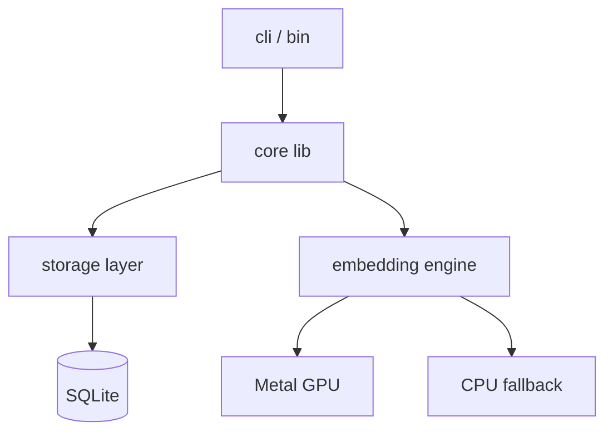
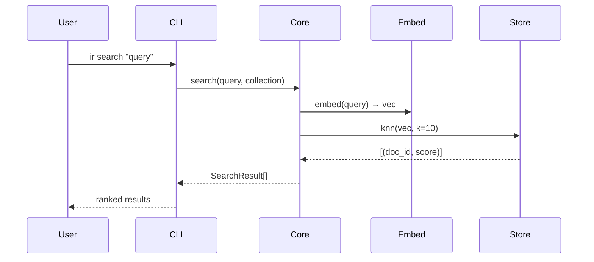

# Overview Template

Template for `knowledge/overview.md` (docs-as-code) or `bigpicture/{project}-overview.md` (legacy vault). Fill all required sections. Use mermaid for diagrams.

---

**Docs-as-code:** `knowledge/overview.md`
**Legacy vault:** `bigpicture/{project}-overview.md`

```markdown
---
slug: overview
kind: overview
last-verified: YYYY-MM-DD
---

# {Project Name}

## What It Is

One paragraph: what this project does, who uses it, the core problem it solves. No jargon.

## Architecture

Module map — update whenever a module is added, removed, or substantially changed.



Key modules:
| Module | Path | Responsibility |
|--------|------|---------------|
| cli | `src/cli/` | Argument parsing, user output |
| core | `src/lib.rs` | Public API surface |
| storage | `src/store/` | Index persistence, knn search |
| embed | `src/embed/` | Model loading, vector generation |

## Data Flow

How data moves through the system end-to-end.



## Key Abstractions

Core APIs and patterns that MUST be used. Do not reimplement these.

- **`Collection`** (`src/store/collection.rs`): all index operations go through this. Never touch SQLite directly.
- **`Embedder` trait** (`src/embed/mod.rs`): implement this to add a new model backend. Existing: `MetalEmbedder`, `CpuEmbedder`.
- **`SearchResult`** (`src/lib.rs`): canonical result type — always return this from search paths.
- **Error handling**: use `IrError` enum variants. Do not use `anyhow` in library code.

## Boundaries

**In scope**: local semantic search, collection management, CLI and MCP interfaces.

**Out of scope**: cloud sync, multi-user, document editing, web UI.

**Integration points**:
- Claude Code calls via MCP (`ir-mcp` binary, stdio protocol)
- Shell scripts call CLI directly
- No public HTTP API
```

---

## Notes for Agents

- Update **Architecture** when: new module added, module renamed, dependency changed
- Update **Data Flow** when: new path through the system, sequence of calls changes
- Update **Key Abstractions** when: new public API surface, existing API deprecated
- Update **Boundaries** when: scope expands/contracts, new integration point added
- `last-verified` = date this file was confirmed accurate against the codebase
